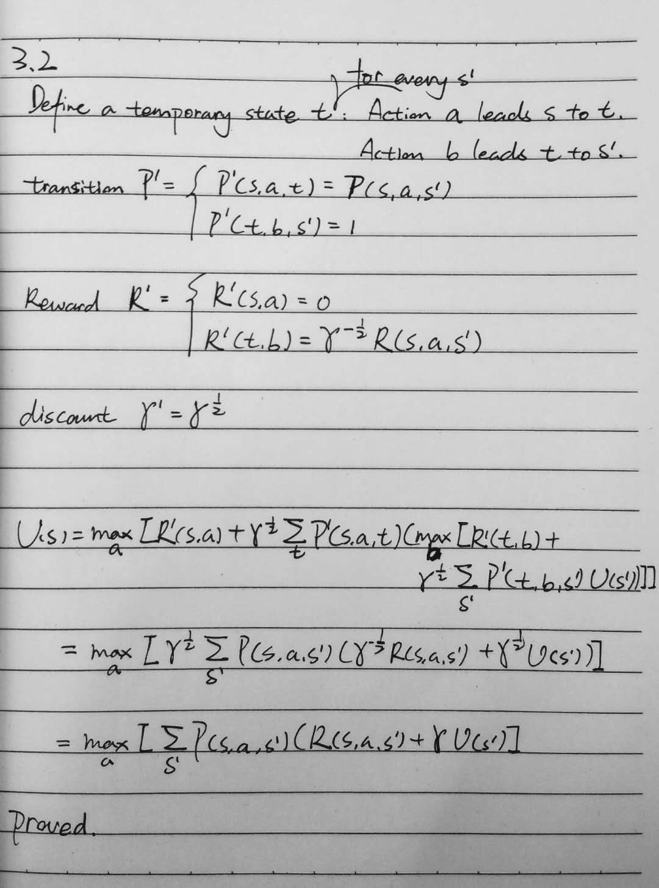
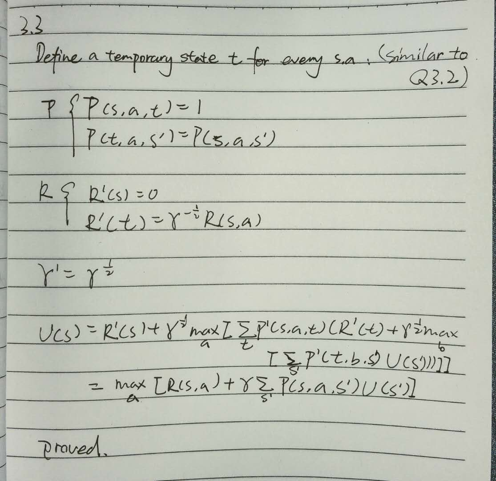

% CS683 Homework 06
% Cen Wang

# Gridworld MDP

## Value iteration

Values:

|             |             |             |             |             |             |
|-------------|-------------|-------------|-------------|-------------|-------------|
| 77.56284247 | 76.77388659 | -100        | -100        | 94.70685506 | 95.80099735 |
| 78.91146196 | 80.46223954 | 82.30693215 | 93.57716989 | 95.95371669 | 97.18776514 |
| 77.85386081 | 79.39305161 | 82.378739   | 95.93888126 | 97.32819074 | 98.59202119 |
| 67.85386081 | -100        | -100        | 97.18611676 | 98.59202119 | 100         |

Best actions:

|               |               |              |               |               |              | 
|---------------|---------------|--------------|---------------|---------------|--------------| 
| $\downarrow$  | $\leftarrow$  | NA           | NA            | $\rightarrow$ | $\downarrow$ | 
| $\rightarrow$ | $\rightarrow$ | $\downarrow$ | $\downarrow$  | $\rightarrow$ | $\downarrow$ | 
| $\uparrow$    | $\uparrow$    | $\uparrow$   | $\rightarrow$ | $\rightarrow$ | $\downarrow$ | 
| $\leftarrow$  | NA            | NA           | $\rightarrow$ | $\rightarrow$ | NA           | 

## Value iteration problem

The program never stops. In this problem, there are two trap states 4 and 6, which means once an agent steps into these two states, they can never get out. Because $\gamma$ is set to 1, the agent can receive infinite rewards, so $|U[s] - U'[s]|$ for state 4 and 6 will never become less than $\epsilon$. The program will continue forever.

## Solution

Optimal policy should look like:

|              |              |              |               | 
|--------------|--------------|--------------|---------------| 
| $\uparrow$   | $\uparrow$   | $\uparrow$   | $\downarrow$  | 
| NA           | $\downarrow$ | NA           | $\rightarrow$ | 
| $\downarrow$ | NA           | $\downarrow$ | $\leftarrow$  | 
 

We can use ***polciy iteration*** to get the optimal policy automatically. This is because all components in policy iteration are garenteed to stop after some finite steps. First, `policy_evaluation` will stop because we can limit how many iterations the algorithm will approximate the utilities. Second, `policy_improvement` will also stop because in state 4 and 6, even the rewards are changing, the choice of action in these two states does not affect the evaluation of the policy ($\sum_{s'} P(s' \mid s, a) U(s
')$ is always 0). Therefore, the algorithm will always stop and return a policy.

## Moving in all directions

No. If there is probability of moving in all four directions, then the agent has no way of preventing itself from being trapped in state 4 and 6. Even if it tries to be careful, it will step into traps with some probability. But we think policy iteration will still provide an optimal policy in this bad situation.

## Solution

We can still use policy iteration to achieve the goal. The policy we have is still optimal. It is only that the agent will have chance to get into trap. Another way we can think of is that we can keep track of how many times we have been in a particular state, that is state becomes a tuple `(location, how_long_in_current_location)`. If we observe `how_long_in_current_location` exceeds some threshold, we just stop and start again.

# Tower of Hanoi

## Formulation

### Objects

- `disk_1`, `disk_2`, ..., `disk_n`
- `rod_1`,`rod_2`, `rod_3`

(Think rod as a disk that is not moveable)

### Predicates

`on(disk1, disk2)` is true if `disk1` is on `disk2`
`is-rod(disk)` is true if something is a rod, it is not a normal disk and not movable
`top(disk)` is true if there is nothing on top of `disk`
`smaller(disk1, disk2)` is true if `disk1` is smaller than `disk2`

### Initial state

Rods are not disks:

```
for i in {1, 2, 3}:
    is-rod(rod_i)
```

`rod_2` and `rod_3` are empty:

```
top(rod_2)
top(rod_3)
```

Disk on top of other disk:

```
for i in {1, 2, ..., n - 1}
    on(disk_i, disk_{i + 1})

on(disk_n, rod_1)
```

Disk size:

```
for i in {1, 2, ..., n - 1}
    smaller(disk_i, disk_{i + 1})
```

Disk 1 is on top:

```
top(disk_1)
```

### Goal

```
for i in {1, 2, ..., n - 1}
    on(disk_i, disk_{i + 1})

on(disk_n, rod_2)
```

### Operator

`move-disk` moves `disk1` which is on top of `disk2` to `disk3`

Parameters: disk1 disk2 disk3

Precondition:

($\lnot$ is-rod(disk1)) $\land$ top(disk1) $\land$ top(disk3) $\land$ on (disk1, disk2) $\land$ (is-rod(disk3) $\lor$ smaller(disk1, disk3))

Positive effects:

on(disk1, disk3) $\land$ top(disk2)

Negative effects:

$\lnot$ on(disk1, disk2) $\land$ ($\lnot$ top(disk3)

## Solution

Domain file:

```
(define (domain tower-of-hanoi)

  (:predicates
    (on ?disk1, ?disk2)
    (is-rod ?disk)
    (top ?disk)
    (smaller ?disk1 ?disk2)
  )

  (:action move-disk
    :parameters (?disk1 ?disk2 ?disk3)
    :precondition (and
      (not (is-rod ?disk1))
      (top ?disk1)
      (top ?disk3)
      (on ?disk1, ?disk2)
      (or
        (is-rod ?disk3)
        (smaller ?disk1 ?disk3)
      )
    )
    :effect (and
      (not (on ?disk1 ?disk2))
      (on ?disk1 ?disk3)
      (top ?disk2)
      (not (top ?disk3))
    )
  )
)
```

Problem file:

```
(define (problem tower-of-hanoi)

  (:domain tower-of-hanoi)

  (:objects disk1 disk2 disk3 rod1 rod2 rod3)

  (:init
    (is-rod rod1)
    (is-rod rod2)
    (is-rod rod3)
    (top rod2)
    (top rod3)
    (on disk3 rod1)
    (on disk2 disk3)
    (on disk1 disk2)
    (smaller disk1 disk2)
    (smaller disk1 disk3)
    (smaller disk2 disk3)
    (top disk1)
  )

  (:goal (and
    (on disk3 rod2)
    (on disk2 disk3)
    (on disk1 disk2))
  )
)
```

Plan:

```
step    0: MOVE-DISK DISK1 DISK2 ROD2
        1: MOVE-DISK DISK2 DISK3 ROD3
        2: MOVE-DISK DISK1 ROD2 DISK2
        3: MOVE-DISK DISK3 ROD1 ROD2
        4: MOVE-DISK DISK1 DISK2 ROD1
        5: MOVE-DISK DISK2 ROD3 DISK3
        6: MOVE-DISK DISK1 ROD1 DISK2
```

Explanation:

```
0: Move DISK1 to ROD2
1: Move DISK2 to ROD3
2: Move DISK1 to ROD3
3: Move DISK3 to ROD2
4: Move DISK1 to ROD1
5: Move DISK2 to ROD2
6: Move DISK1 to ROD2
```

# Bellman Equation

## Update Rule

In the most general case, when $R = R(s, a, s')$:

$$
\begin{aligned}
U(s_t) & = E[R(s_t, a, s_{t + 1}) + \gamma R(s_{t + 1}, a, s_{t + 2}) + \gamma ^ 2 R(s_{t + 2}, a, s_{t + 3}) + ...] \\
U(s) & = E[R(s, a, s') + \gamma U(s')] \\
U(s) & = \sum_{s'} P(s' \mid s, a) (R(s, a, s') + \gamma U(s'))
\end{aligned}
$$

Bellman equation is given by:

$$
U(s) = \max_a \sum_{s'} P(s' \mid s, a) (R(s, a, s') + \gamma U(s'))
$$

When $R = R(s, a)$:

$$
\begin{aligned}
U(s) & = \max_a \sum_{s'} P(s' \mid s, a) (R(s, a) + \gamma U(s')) \\
U(s) & = \max_a (\sum_{s'} P(s' \mid s, a) R(s, a) + \sum_{s'} P(s' \mid s, a) \gamma U(s')) \\
U(s) & = \max_a (R(s, a) \sum_{s'} P(s' \mid s, a) + \gamma \sum_{s'} P(s' \mid s, a) U(s'))
\end{aligned}
$$

Notice that:

$$
\sum_{s'} P(s' \mid s, a) = 1
$$

We have: 

$$
U(s) = \max_a (R(s, a) + \gamma \sum_{s'} P(s' \mid s, a) U(s'))
$$

## Transformation

From $R(s, a, s')$ to $R(s, a)$:


\ 


\ 

# Average Reward Criterion

## Different policies

There are two policies. Either choose left or right at state 1.

## Policy value

Left:

$$
\sum_{i = 1}^{\infty} 5 \gamma ^ {5 i - 1} = \frac{5 \gamma^{4}}{- \gamma^{5} + 1}
$$

Right:

$$
\sum_{i = 1}^{\infty} 20 \gamma ^ {10 i - 1} = \frac{20 \gamma^{9}}{- \gamma^{10} + 1}
$$

## Printer or Mailroom

Solving the equation:

$$
\frac{5 \gamma^{4}}{- \gamma^{5} + 1} - \frac{20 \gamma^{9}}{- \gamma^{10} + 1} = 0
$$

We have:

$$
\gamma ^ * = 0.8027415617602308
$$

Also we know that $f(\gamma) = \frac{5 \gamma^{4}}{- \gamma^{5} + 1} - \frac{20 \gamma^{9}}{- \gamma^{10} + 1}$ is monotonically decreasing in $(0, 1)$. So we know:

- When $0 < \gamma < \gamma ^ *$, $f(\gamma) > 0$, go left (printer)

- When $\gamma ^ * < \gamma < 1$, $f(\gamma) < 0$, go right (mailroom)

## Blackwell optimal

Yes. We have showed that when $\gamma ^ * < \gamma < 1$, going to mailroom is always a better strategy.

## Average reward

Left:

We get 5 points every 5 steps, so the average reward is 1.

Right:

We get 20 points every 10 steps, so the average reward is 2.

## Same policy

Using average reward, the agent will go right. We showed that when $\gamma ^ * < \gamma < 1$, the agent will choose to go right using discounted reward. So, when $\gamma ^ * < \gamma < 1$, both have the same strategy.
